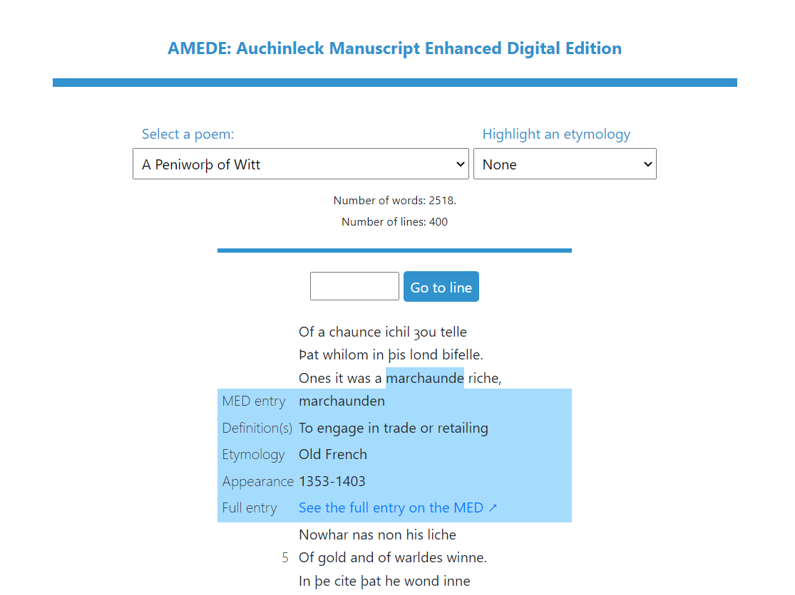
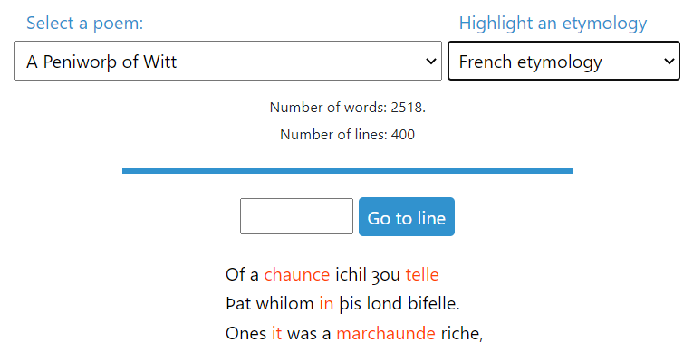
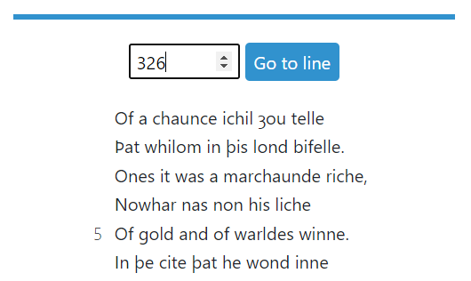
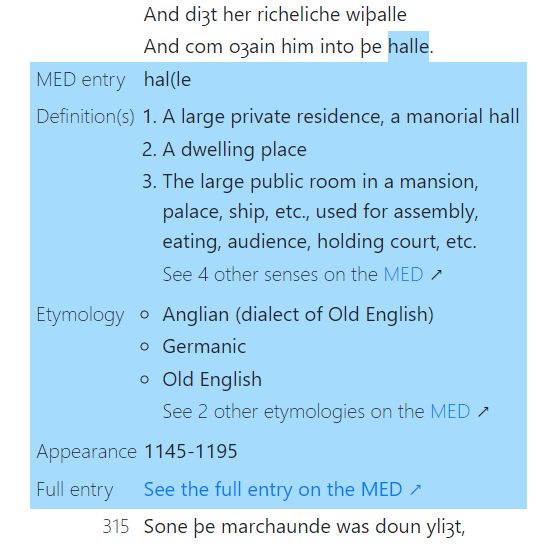

# AMEDE: Auchinleck Manuscript Enhanced Digital Edition

## Demo
https://solliryc.github.io/AMEDE/

## Description
Le Auchinleck Manuscript est un recueil de poèmes produit à Londres dans les années 1330, qui fait office d'oeuvre de référence de la période du Middle English (env. de 1050 à 1500). Composé de 43 poèmes, le Auchinleck Manuscript donne de nombreuses informations sur l'état de la langue anglaise et la formation des dialectes à une époque où la langue anglaise n'était pas uniformisé.

Il est donc intéressant d'analyser de quelles étymologies viennent les mots présents dans l'ouvrage et à quel moment ces mots ont fait leur apparition dans la langue anglaise. De plus, le fait que le Auchinleck Manuscript soit composé de plusieurs textes distincts, d'auteurs différents, permet d'observer des différences entre l'un ou l'autre des poèmes.

## Données
La récupération des données nécessaires s'est effectuée en deux temps. D'abord, il a fallu récupérer les données concernant le Manuscript en isolant les mots qui composent ses textes (son lexique). Ensuite, il a fallu trouver pour chacun des mots du lexique ses données etymologiques et temporelles, au moyen du Middle English Dictionary, le dictionnaire de référence pour cette forme de la langue anglaise.

Il n'existe pas de fichier de données du Auchinleck Manuscript prêt à être analysé. Il a fallu donc utiliser la version numérisée en HTML du [Auchinleck Manuscript](https://auchinleck.nls.uk/), éditée par David Burnley et Alison Wiggins, a été mise en ligne en 2003. Cette version a été archivée [en format XML](https://ota.bodleian.ox.ac.uk/repository/xmlui/handle/20.500.12024/2493) par le Oxford Text Archive, un catalogue de contenu numérique littéraire et linguistique. A partir de ces fichiers XML, il a été possible d'extraire une liste de tous les mots uniques qui apparaissent dans le texte, soit un total de 16'673 mots.

Comme pour le Auchinleck Manuscript, il n'existe pas de fichier de données du Middle English Dictionary (MED) prêt à être analysé. Il a fallu donc récupérer les données à partir de la version numérique du [MED](https://quod.lib.umich.edu/m/middle-english-dictionary). Cette version du MED comporte plus de 54'000 entrées, qui sont homogènes au niveau de la mise-en-forme, mais pas uniformes au niveau du contenu. Certaines entrées ont des données étymologiques et temporelles, d'autres pas. L'année d'apparition d'un mot dans la langue est récupérée dans les citations associées à ce mot. Les années qui figurent dans les citations sont données sous la forme d'un intervalle de 25 ou 50 ans. Si plusieurs intervalles sont donnés, le plus ancien est retenu comme l'intervalle durant lequel le mot est apparu. Au total, 54'507 entrées du MED ont été extraites.

Une fois ces deux jeux données récupérés, il a fallu les mettre en commun. Il n'a été gardé que les mots du Auchinleck Manuscript pour lesquels une correspondance avec une entrée du MED pouvait être établie. Cette correspondance avec le MED a été réalisée grâce au moteur de recherche disponible sur le site du MED.

Ainsi, un lexique de 14'378 mots, répartis dans 43 poèmes différents, totalisant 309'351 occurrences, et comprenant 96 étymologies différentes, a été produit.

## Fonctionnalités
### Sélection d'un poème

Ce menu permet de sélectionner l'un des 43 poèmes du Auchinleck Manuscript et d'afficher son contenu.

La recherche d'un mot du lexique affiche 6 champs en-dessous de la barre:
* le mot
* l'intervalle durant lequel le mot est apparu dans le Middle English
* le ou les étymologies du mot
* le nombre de fois que le mot apparaît dans le manuscript
* le nombre de poèmes dans lequel le mot apparaît
* le lien vers l'entrée du mot dans le MED

### Mise en valeur d'une étymologie

Cette option permet de mettre en valeur dans le texte du poème les mots d'une certaine étymologie. Les mots appartenant à cette étymologie deviennent orangé dans le texte.

Il est possible de choisir l'une des 5 catégories d'étymologie:
* etymologies apparentées à l'anglais
* etymologies apparentées au français
* etymologies apparentées au latin
* etymologies apparentées aux langues scandinaves
* etymologies apparentées à d'autres langues

### Aller à un numéro de ligne

Cet outil permet de se rendre directement à un numéro de ligne du poème sélectionné. Utilisation de la touche "Entrée" possible.

Si le numéro de ligne est supérieur au nombre de lignes total du poème, le lecteur est redirigé à la fin du poème. Si le numéro de ligne entré est dans les limites du poème, mais qu'il n'en fait pas partie (par exemple si des vers ont été perdus et n'ont pas pu être retranscrit), le lecteur est redirigé vers le numéro de ligne existant le plus proche.

### Dictionnaire

Pour chaque mot du poème, il est possible d'obtenir de multiples informations en cliquant dessus. Ces informations proviennent du Middle English Dictionary ([MED](https://quod.lib.umich.edu/m/middle-english-dictionary)).

Les informations disponibles sont les suivantes:
* MED entry: la forme du mot retenue dans le MED
* Definition(s): la ou les définitions du mot. S'il y a plus de 3 définitions, seules les 3 premières sont affichées et un lien invite le lecteur à se rendre sur la page correspondante du MED.
* Etymology: la ou les étymologies du mot. S'il y a plus de 3 étymologies, seules les 3 premières sont affichées et un lien invite le lecteur à se rendre sur la page correspondante du MED.
* Appearance: les années approximatives durant lesquelles le mot est apparu dans la langue anglaise 
* Full entry: lien redirigeant vers l'entrée du mot dans le MED

## Discussion
Cette édition numérique du Auchinleck Manuscript permet une lecture confortable des poèmes.

Par rapport aux textes présents sur le site original [Auchinleck Manuscript](https://auchinleck.nls.uk/), le AMEDE offre un confort de lecture adapté à la fois aux lecteurs sur un ordinateur ou sur un appareil mobile. Les numéros de ligne et les notes présents sur le site original ont été conservés. Avec AMEDE, il est possible de sélectionner une partie ou la totalité du texte, sans sélectionner en même temps les numéros de ligne, ce qui n'est pas le cas avec le site original.

Il serait intéressant d'obtenir une analyse de ces visualisations de la part d'une personne spécialiste du Middle English ou de la langue anglaise en général. Elle pourrait potentiellement interpréter ces résultats avec une plus grande certitude.

## A propos
### Librairies utilisées
* Bootstrap 4.5.0
* D3 5.16.0
* JQuery 3.5.1
* Popper 1.16

### Sources
* [The Auchinleck Manuscript](https://auchinleck.nls.uk/) (eds: David Burnley and Alison Wiggins, National Library of Scotland, 2003)
* <a href="https://ota.bodleian.ox.ac.uk/repository/xmlui/handle/20.500.12024/2493" target='_blank'>The Auchinleck Manuscript on the Oxford Text Archive</a> (eds David Burnley and Alison Wiggins, National Library of Scotland, Oxford Text Archive, 2003)
* <a href="https://quod.lib.umich.edu/m/middle-english-dictionary" target="_blank">Middle English Dictionary</a> (eds: Frances McSparran, Ann Arbor, et al., University of Michigan Library, 2000-2018)

### Auteur
Ce projet a été réalisé par Cyrille Gay-Crosier dans le cadre du cours de Master <i>Publication numérique</i>, donné par Isaac Pante, en automne 2019, à l'UNIL.

### Remerciements
Rory Critten (MER en Anglais à l'UNIL) et Davide Picca (MER en Informatique pour les sciences humaines à l'UNIL) pour leur aide et leurs conseils dans la récupération et le traitement des données.
